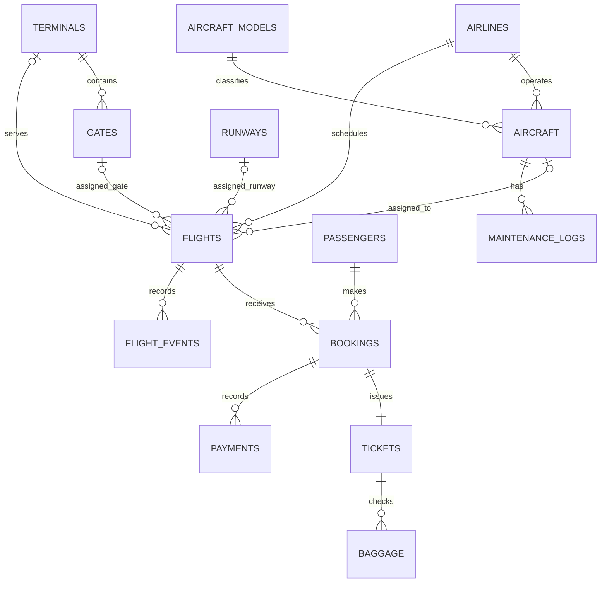

# Simplified entity relationship map

```mermaid
erDiagram
  AIRLINES ||--o{ AIRCRAFT : operates
  AIRCRAFT_MODELS ||--o{ AIRCRAFT : classifies
  AIRLINES ||--o{ FLIGHTS : schedules
  AIRCRAFT o|--o{ FLIGHTS : assigned_to
  TERMINALS ||--o{ GATES : contains
  TERMINALS o|--o{ FLIGHTS : serves
  GATES o|--o{ FLIGHTS : assigned_gate
  RUNWAYS o|--o{ FLIGHTS : assigned_runway
  PASSENGERS ||--o{ BOOKINGS : makes
  FLIGHTS ||--o{ BOOKINGS : receives
  BOOKINGS ||--|| TICKETS : issues
  BOOKINGS ||--o{ PAYMENTS : records
  TICKETS ||--o{ BAGGAGE : checks
  AIRCRAFT ||--o{ MAINTENANCE_LOGS : has
  FLIGHTS ||--o{ FLIGHT_EVENTS : records
```

The diagram is simplified; nullable foreign keys represent flights whose aircraft/gate/runway assignment is not recorded in the sample.
